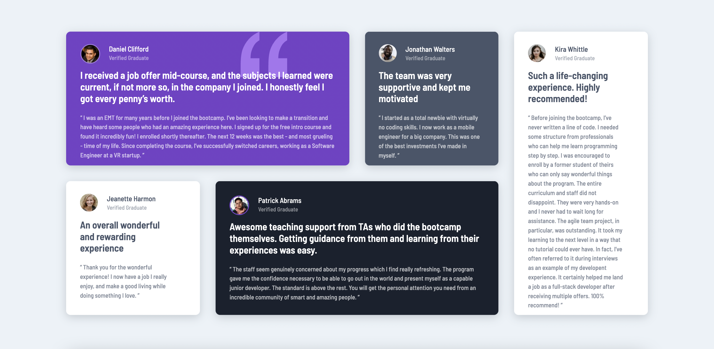

# Frontend Mentor - Testimonials Grid Section Challenge Hub solution

This is a solution to the [Testimonials Grid Section Challenge Hub on Frontend Mentor](https://www.frontendmentor.io/challenges/testimonials-grid-section-Nnw6J7Un7). 

## Table of contents

- [Overview](#overview)
  - [The challenge](#the-challenge)
  - [Screenshot](#screenshot)
  - [Links](#links)
- [My process](#my-process)
  - [Built with](#built-with)
  - [What I learned](#what-i-learned)
  - [Continued development](#continued-development)
  - [Useful resources](#useful-resources)
- [Author](#author)

## Overview

### The challenge

Users should be able to:

- View the optimal layout for the site depending on their device's screen size

### Screenshot



### Links

- Solution URL: This is my [solution](https://www.frontendmentor.io/solutions/testimonials-grid-section-challenge-hub-Rkif4Rxie)
- Live Site URL: This is the [live site](https://coder-txane.github.io/Testimonials-Grid-Section-Challenge-Hub/)

## My process

### Built with

- Semantic HTML5 markup
- CSS Grid
- Flexbox

### What I learned

One of the major learnings I discovered while building this website was that in order to correctly adjust the z-index of the favicon image, I had to also adjust the z-index of other corresponding elements, rather than just the favicon image itself.

```css
.favicon {
   position: absolute;
   z-index: -1;
}

#testimonial-one {
   grid-column: 1 / 3;
   grid-row: 1;
   z-index: 1;
}

.header {
   margin: 5px auto 20px;
   z-index: 2;
}
```

### Continued development

Areas I would like to continue refining in the future include:
- CSS Grid
- Flexbox
- Responsive Design
- Keyboard Accessibility

### Useful resources

- [Stackoverflow](https://stackoverflow.com/) - This helped me investigate how to effectively implement different concepts.

- [MDN Web Docs](https://developer.mozilla.org/en-US/) - This is an amazing website which helped me further understand certain concepts such as tabindex.

- [Frontend Mentor] (https://www.frontendmentor.io/challenges) - This website is where I found this challenge. It's a great resources for those who want to challenge themselves to different coding tasks. In this case, I chose this challenge which helps build confidence in CSS Grid. It also includes a report that allows me to see whether I have any html or accessibility issues that require attention in my document. Furthermore, the site includes a design comparison section which let me compare my own work with the original design.

## Author

- Frontend Mentor - [@coder-txane](https://www.frontendmentor.io/profile/coder-txane)
